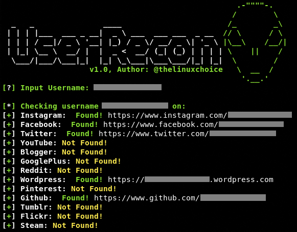

# UserRecon v1.0
# Author: @thelinuxchoice
# https://github.com/thelinuxchoice/userrecon

# Some of "Found!" result is wrong/incorrect
Edit "grep -o 'sometexthere' ; echo $?" to fix the problem

Find usernames across over 75 social networks
This is useful if you are running an investigation to determine the usage of the same username on different social networks.

## TODO:

  - [ ] Fix or remove Instagram check
  - [ ] Fix or remove Facebook check
  - [ ] Fix or remove Twitter check
  - [ ] Fix or remove Google+ check
  - [ ] Fix or remove Wordpress check
  - [ ] Fix or remove Pintrest check
  - [ ] Fix or remove Flickr check
  - [ ] Fix or remove Imgur check
  - [ ] Fix or remove Fotolog check
  - [ ] Fix or remove MixCloud check
  - [ ] Fix or remove Patreon check
  - [ ] Fix or remove CashMe check
  - [ ] Fix or remove Instructables check
  - [ ] Fix or remove Keybase check
  - [ ] Fix or remove AngelList check
  - [ ] Fix or remove Foursqyare check
  - [x] Fix or remove Roblox check
  - [ ] Fix or remove Gumroad check
  - [ ] Fix or remove Canva check
  - [ ] Fix or remove CreativeMarket check
  - [ ] Fix or remove Houzz check
  - [ ] Fix or remove ColourLovers check
  - [ ] Fix or remove Trip check
- [x] Rename Github to GitHub
- [ ] Alphabetize the checks
- [ ] Add the website name to the created document
- [ ] Add more checks
- [ ] Possibly add in controlled variations?
- [ ] Add triple (maybe more?) checking to determine which are false-positives, or false negatives
# Installation 

$ sudo apt update && apt upgrade

$ git clone https://github.com/wishihab/userrecon.git

$ cd userrecon

$ ./userrecon.sh

### This tool has been tested in many os like parrot os , kali linux ,ubuntu os all of them works perfectly fine  !
